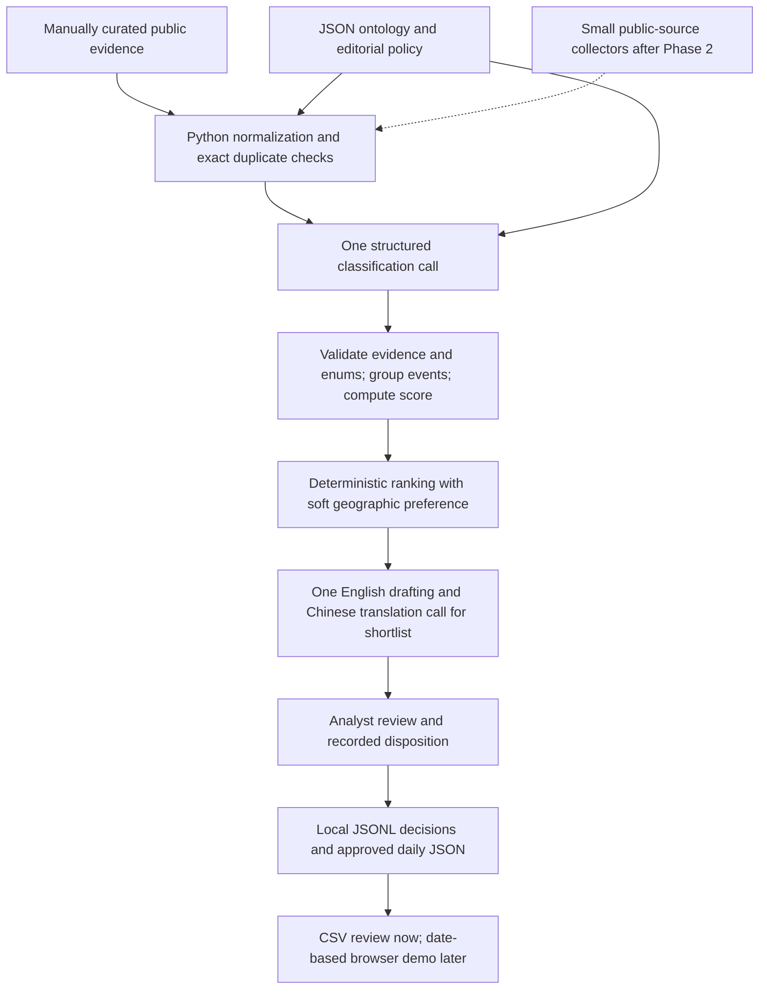

# Architecture review — local editorial prototype first

Status: Phase 1 specification v0.1.0, prepared 2026-09-10. Proposed calibration settings are not empirically validated.

## Decision

Confirm the hypothesis: prove investment filtering before adding infrastructure. The difficult deliverable is a defensible selection of events, not a news database. Start with locally executed Python, JSON configuration and JSONL decisions, with CSV exports for analyst review. A hosted LLM is an optional external service, so **local execution does not mean offline inference**. Send only permitted public evidence and generic monitoring rules; keep private exposure overlays out of model inputs and Git.

At 10 selected events per day, 90 days represents about 900 cards. This does not justify a hosted database, API service, vector store or scheduler. Candidate evidence can be much larger; retain only what is permitted and needed for reproducibility. Do not equate the display window with automatic deletion of evaluation evidence.

## Context reviewed and limits

Reviewed the current detailed handover and all retrievable exchanges from the referenced **Build News Dashboard** conversation (ID `6aa25386-6e9c-83ec-bc1a-079ff85968ba`). The reader returned five exchanges with no older-page cursor. Three assistant replies were capped at 20,000 characters. A browser attempt to recover the full conversation timed out. Therefore this is not a claim that every character of the original conversation was available. The current handover repeats the detailed requirements and explicitly authorizes the review followed by Phase 1; implementation is limited to that specification scope. Reconcile any subsequently supplied omitted context before Phase 2 is frozen.

The original plan proposes Next.js/TypeScript/Tailwind, Supabase/PostgreSQL, Vercel, scheduled ingestion, several AI stages and late calibration. It already correctly separates watchlist and market discovery, suggests structured outputs, and rejects unconstrained autonomous web browsing. Earlier paid-source suggestions are superseded by the public-only requirement. Its model names, prices, numerical example scores, source-volume estimates and time estimates are not verified facts or architecture dependencies.

Initial repository: README only, clean working tree. GitHub metadata reports the repository is public. Files prepared here are a monitoring specification, not a disclosure of actual holdings. Do not push internal portfolio data, article caches or analyst annotations to this repository. No remote write or deployment is part of this task.

## Keep, simplify and change

| Area | Decision and reason |
|---|---|
| Product | Keep watchlist-first selection, factual summaries, separate interpretation, source links, EN/Chinese, date navigation and about 90 days of visible history. |
| Discovery | Keep two streams: named managers/vehicles and manager-independent sectors/themes. Otherwise the engine misses systemic events. |
| Entity resolution | Keep explicit entities and typed relationships. A managed fund is not necessarily a corporate subsidiary. A sponsor is not necessarily the lender. |
| AI | Merge relevance, semantic disambiguation, event classification, transmission and score-anchor selection into one structured decision call per candidate/event evidence packet. |
| Deduplication | Normalize URLs and exact content duplicates before inference; cluster proposed events after classification using parties, action, asset/vehicle, period and dates. Human resolves ambiguous clusters. |
| Scoring | Keep six weights as a baseline, use discrete anchors, compute totals in Python, and reject ineligible/unsupported events before scores can rescue them. |
| Writing | One structured call for shortlisted events: grounded English summary and interpretation, then Chinese derived from that English within the same response. Human checks both. Split translation only if the error rate warrants it. |
| Calibration | Move to Phase 2 and repeat after ingestion. Do not wait for a finished UI to learn that editorial precision is poor. |
| Storage | JSON/JSONL first; CSV is a review projection, not the nested decision source of truth. Add SQLite only when local querying, revisions or restart handling becomes inconvenient. |
| Presentation | After a successful prototype, a locally served static HTML/JS page can read approved daily JSON. A framework is optional, not a prerequisite. |

## MVP architecture

No autonomous agent framework. A simple pipeline has explicit inputs, bounded costs, inspectable failures and replayable stages. Multiple agents add repeated reading, correlated judgements, disagreement resolution, latency and harder provenance. A separate human or one-off independent model critique can help evaluate a frozen sample; it does not justify agents in the daily application. Add a model adjudication call only if measured ambiguity volume and error reduction justify it. Do not trust self-reported model confidence as a calibrated probability.

LLM outputs select anchor values and provide evidence references; they do not set publication status, mutate mappings, fetch arbitrary URLs, or approve overrides. Article text is untrusted data, never instructions. Failed parsing, conflicting evidence and unresolved entities enter review, never silently become zero-score rejections.

## Minimum stack and deliberate deferrals

Now: Markdown + UTF-8 JSON + Git; Python 3.13 is available locally for structural checks. Phase 2: Python standard library (`json`, `csv`, `hashlib`, `unittest`) plus one selected provider SDK if live inference is used. Pin the actual SDK/model snapshot when the experiment starts; choose on measured quality and token cost, not prior-chat model recommendations. A structured-output capability is a selection criterion, not evidence of factual correctness.

Postpone PostgreSQL/Supabase, Next.js, Vercel, production APIs, authentication/accounts, cron, queues, alerts, monitoring services, vector databases, embeddings and multiple LLM agents. Also postpone broad crawling, automated 90-day deletion, exhaustive subsidiary graphs and numerical portfolio-exposure estimation. No paid-source integration.

Trigger SQLite when persisted joins/revisions/restart handling simplify work; keep it on a non-synced local path rather than actively editing a database in OneDrive. Trigger hosting only when someone needs shared access. Determine permitted audience before deployment; an internal dashboard must not become publicly accessible by accident. Trigger a scheduler only after several manual daily runs succeed. These are future decisions, not infrastructure designs in Phase 1.

## Revised phases and dependencies

| Phase | Deliverable | Exit evidence | Change from original |
|---|---|---|---|
| 0 — Scope | Current product brief | Defined audience, public-only scope, selection objective | Retained; consolidated in these docs. |
| 1 — Editorial specification | Ontology, rulebook, source evidence, evaluation protocol | All requested concepts represented; uncertainty explicit; structural checks pass | This task. |
| 2 — Local intelligence experiment | Fixed real-article sample, rules baseline, structured decisions, sample bilingual cards, analyst labels | Precision/recall, attribution, clustering and bilingual criteria in phase-2-experiment.md | Combines prototype, thin AI pipeline and early QA. |
| 3 — Small ingestion pilot | Selected public endpoints feeding the same local pipeline, manually run | Five consecutive news-day replays, logged gaps/retries, approved daily JSON | Add a few high-yield sources, not a universal collector. |
| 4 — Browser demo | Today/date navigation, tags, original links, EN/Chinese, empty/stale states | Analyst usability check and date/language parity | Frontend later, storage/backend only if needed. |
| 5 — Internal delivery | Reproducible launch/runbook and agreed hosting if needed | Audience/access decision, source permissions, daily owner and recovery demonstrated | Combines deployment and handover. |

Quality evaluation continues at each phase. Forecast remaining effort after Phase 2 records actual review time and source-access friction; the prior 10–15-day estimate is not a delivery commitment. An early browser mockup can help test card readability later, but building it now does not test story selection.

## Assumptions to test before architecture commitment

1. Public evidence supplies enough **useful**, timely private-credit events; 6–10 is a preference, never a promised minimum.
2. Analysts agree on publish/reject decisions and A/B/C scope sufficiently to provide stable labels.
3. Watchlist/strategy proxies are useful without inventing holding sizes or specific fund allocations.
4. Deterministic candidate matching plus one semantic decision call handles ambiguity and recall.
5. Conservative event clustering avoids both duplicate cards and merging distinct deals.
6. Bilingual drafting preserves quantities, entity names, conditionality and attribution at acceptable review cost.
7. The scoring rubric adds value over simpler anchored materiality/transmission ranking.
8. Europe has enough eligible events to approach 20% without diluting quality; measure available supply separately from selection.

## Major risks

| Type | Risk | MVP response |
|---|---|---|
| Technical | Prompt injection / malformed model output | Treat evidence as data; schema and enum checks; no model tools or external actions; bounded retries then review. |
| Technical | Nondeterministic inference/model drift | Save input hashes, exact configs, prompt/model identifiers, output and attempt IDs. Replay saved outputs separately from new inference. |
| Technical | Duplicate/revised stories, timezone drift | Separate article, event and publication record; preserve event/publication/first-seen dates and corrections. |
| Technical | Source access/extraction failure | Explicit unavailable status; snippets are discovery only unless sufficient source evidence is actually accessible; no paywall bypass. |
| Technical | Local/OneDrive concurrent writes | Single writer and atomic files; do not use a live synced SQLite database. |
| Data quality | PR-heavy public sources miss stress | Mix regulatory, borrower and independent public reporting; audit rejected candidates and manually discovered misses. |
| Data quality | Wrong fund/manager role | Store match spans and typed relationship paths; preserve vehicle; sponsor/adviser/arranger/lender roles are distinct. |
| Data quality | Headline dollar amounts exaggerate materiality | Record denominator, as-of date, currency and amount basis; commitments are not deployed cash; leverage is not equity raised. |
| Data quality | Stale mappings and stale pages | Evidence references, verification dates and review flags; recheck before historical replay or expansion. |
| Data quality | Generic macro or fabricated transmission | Require an observed new trigger and a specific strategy mechanism; label inference and include countervailing channels where material. |
| Data quality | Evaluation leakage / subjective labels | Analyst labels independently, split by event family/time, preserve disagreements, freeze holdout before tuning. |

Public accessibility is not a blanket licence to redistribute full text. Source-specific access/reuse review belongs to the ingestion pilot. Store links, metadata and concise original summaries; avoid copying entire articles into the public repo. Discovery providers are not evidence providers by default.
